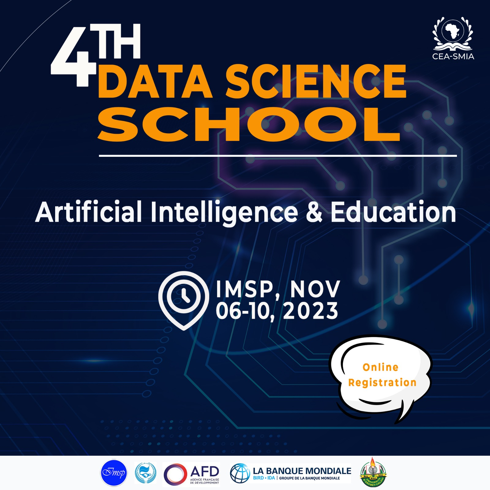
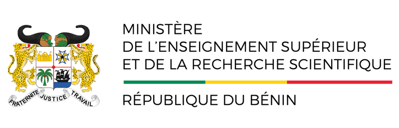

Data Science School 2023 
=============================

## Context
Education faces significant challenges worldwide, particularly in underserved regions. Limited access to quality education, insufficient resources, and a shortage of qualified teachers hinder students' learning and future opportunities. Traditional teaching methods may not suit individual learning needs, leading to disengagement and lower academic outcomes. Additionally, AI's potential in education is limited due to the lack of localized and unbiased training data, affecting students from diverse linguistic and cultural backgrounds. Addressing these issues is crucial to create an equitable and inclusive learning environment, empowering all students to succeed in today's rapidly changing world.

## Objectives

The overall objective of this school is to highlight the benefits of using AI in education in order to enhance the quality of the learning experience and teaching material in different  languages. 
At the end of this school, the participants will be able to :
1. Explain the major innovative approaches around AI for a better education;
2. Identify the challenges of openly available, unbiased and localized training data for underrepresented cultures and languages;
3. Implement at least one use case on AI usage for :
    - Learning experience personalization (including students with special needs),
    - Learning outcomes prediction, 
    - Administrative workflows, 
    - Resource planning, 
    - Curriculum design.
    - Use AI-based approaches for spreading teaching materials to the largest in local languages seamlessly.

## Participants
Educators and Lecturers, EdTech Entrepreneurs, AI Industry representatives, Masters, PhD students, Young AI researchers, Representatives of the Ministries of Education.

## Addressed Topics

- Implement an AI model for notes taking and learning outcome predictions based on silent AI listeners and course materials.  
- Tutorial on LLM models and applications in education
- Conversational agents for teaching 
- Intelligent tutoring systems (ITS)
- Dialogue-based tutoring systems (DBTS)
- AI-driven Personalization for students learning paths
- Ethical considerations in AI-driven education
- AI solutions Survey

## Main speakers
- Théophile Dagba
- John Aoga
- Habib SIDI
- Ratheil Houndji
- Eugène C. Ezin 
- Arnaud Ahouandjinou
- Hafiz Tiomoko Ali
- Jessica LOPEZ
- Ghislain  Atemezing
- Bonaventure Dossou
- Mouhamadou Lamine Ba
- Félicité DOMGUE
- Ifeoma OMOKO
- Matthew EKUM

## Organizers
- Carlos Ogouyandjou
- Joël Tossa
- Habib Sidi
- Arnaud Ahouandjinou
- Ratheil Houndji
- Ghislain  Atemezing
- Pélagie Hounguè
- Hénoc Soude
- Jules Dégila
 
  

## Program

[Check the program details](docs/program.md)

## Speakers

The list of the speakers is available [here](docs/speakers.md)

## Venue

This event will be held at the [Institut de Mathématiques et de Sciences Physiques (IMSP)](http://www.imsp-benin.com/home/) Dangbo, Bénin.

The details for the remote participation will be shared here in due time.

## Partners

- [List of university partners](partners.md)

## Main Sponsor
- [CEA-SMIA](https://ceasma-benin.org/)
  

## Logos

